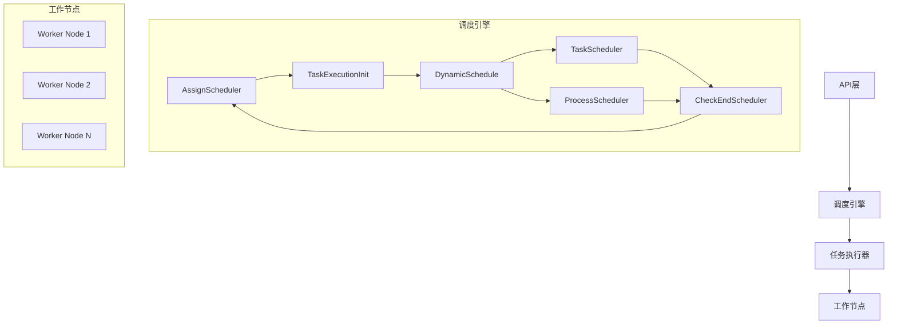

# Piper-AI 流程调度系统

Piper-AI 是一个基于责任链模式的分布式流程调度系统，支持任务编排、动态调度和分布式执行。

## 系统架构



## 核心组件

### 1. 调度引擎 (Scheduler)

- 采用责任链模式实现任务调度流程
- 主要组件：
    - AssignScheduler: 任务分配器
    - TaskExecutionInit: 任务执行初始化
    - DynamicSchedule: 动态调度器
    - TaskScheduler: 任务调度器
    - ProcessScheduler: 流程调度器
    - CheckEndScheduler: 结束检查器

### 2. 任务执行器 (Worker)

- 负责实际任务的执行
- 支持分布式部署
- 通过 ZooKeeper 进行服务发现和负载均衡

### 3. 任务流程 (Task Flow)

- 基于 DAG 的任务编排
- 支持任务依赖关系管理
- 支持动态任务调度

## 技术栈

- 后端框架: Spring Boot
- 服务发现: ZooKeeper
- 任务编排: DAG
- 通信协议: RPC

## 快速开始

1. 启动 ZooKeeper 服务
2. 配置 application.yml
3. 启动调度引擎
4. 启动工作节点
5. 通过 API 提交任务流程

## 配置说明

```yaml
spring:
  application:
    name: piper-ai-worker

zookeeper:
  connect-string: localhost:2181
  session-timeout-ms: 60000
  connection-timeout-ms: 15000
  base-path: /piper-ai

worker:
  max-tasks: 10
```

## 开发指南

1. 任务定义
    - 实现 Task 接口
    - 定义任务处理逻辑
    - 配置任务依赖关系

2. 流程编排
    - 创建 DAG 图
    - 定义节点关系
    - 配置节点属性

3. 任务执行
    - 提交任务流程
    - 监控执行状态
    - 处理执行结果

## 贡献指南

欢迎提交 Issue 和 Pull Request 来帮助改进项目。

## 许可证

MIT License 