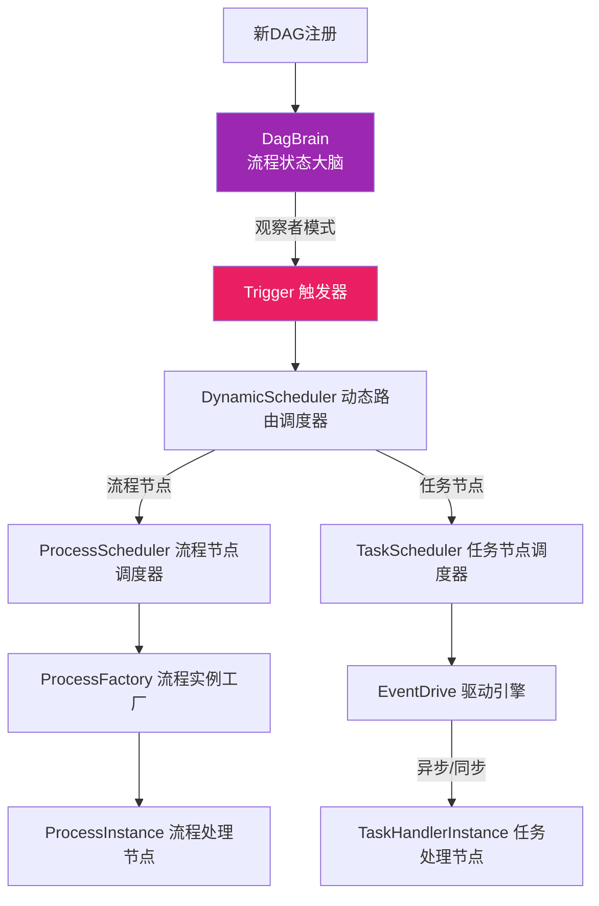

# Piper-AI 分布式流程调度系统

Piper-AI 是一个基于责任链模式的分布式流程调度系统，采用微服务架构设计，支持任务编排、动态调度和分布式执行。系统基于 Spring Boot 3.x 构建，使用 Dubbo 3.x 作为 RPC 框架，ZooKeeper 作为服务注册中心。

## 调度架构



## 项目结构

- `piper-ai-api`: API 接口定义模块
- `piper-ai-app`: 应用服务模块
- `piper-ai-domain`: 领域模型模块
- `piper-ai-infrastructure`: 基础设施模块
- `piper-ai-trigger`: 触发器模块
- `piper-ai-types`: 类型定义模块
- `piper-ai-engine`: 调度引擎模块

## 技术栈

- 后端框架: Spring Boot 3.2.3
- RPC 框架: Dubbo 3.2.17
- 服务发现: ZooKeeper 3.8.3
- 数据库: MySQL 8.0.30
- 构建工具: Maven
- 开发语言: Java 17
- 容器化: Docker & Docker Compose

## 核心特性

1. 分布式任务调度

   - 基于责任链模式的任务调度流程
   - 支持动态任务分配和负载均衡
   - 分布式任务执行和状态管理
2. 任务流程编排

   - 基于 DAG 的任务编排
   - 支持任务依赖关系管理
   - 支持动态任务调度
3. 高可用设计

   - 服务注册与发现
   - 负载均衡
   - 故障转移

## 快速开始

### 环境要求

- JDK 17+
- Maven 3.8+
- Docker 20.10.0+
- Docker Compose 2.0.0+
- MySQL 8.0+
- ZooKeeper 3.8+

### 本地开发

1. 克隆代码库

```bash
git clone [your-repository-url]
cd Piper-AI
```

2. 安装依赖

```bash
mvn clean install
```

3. 启动服务

```bash
mvn spring-boot:run
```

### Docker 部署

详细部署说明请参考 [DEPLOY.md](DEPLOY.md)

## 配置说明

### 基础配置

```yaml
spring:
  application:
    name: piper-ai-worker
  datasource:
    url: jdbc:mysql://localhost:3306/piper_ai
    username: root
    password: root

zookeeper:
  connect-string: localhost:2181
  session-timeout-ms: 60000
  connection-timeout-ms: 15000
  base-path: /piper-ai

dubbo:
  application:
    name: piper-ai
  registry:
    address: zookeeper://localhost:2181
  protocol:
    name: dubbo
    port: 20880
```

## 开发指南

1. 任务定义

   - 实现 Task 接口
   - 定义任务处理逻辑
   - 配置任务依赖关系
2. 流程编排

   - 创建 DAG 图
   - 定义节点关系
   - 配置节点属性
3. 任务执行

   - 提交任务流程
   - 监控执行状态
   - 处理执行结果

## 监控与运维

- 服务健康检查
- 日志管理
- 性能监控
- 告警机制

## 贡献指南

欢迎提交 Issue 和 Pull Request 来帮助改进项目。在提交代码前，请确保：

1. 代码符合项目编码规范
2. 添加必要的单元测试
3. 更新相关文档
4. 提交信息清晰明确

## 许可证

MIT License
